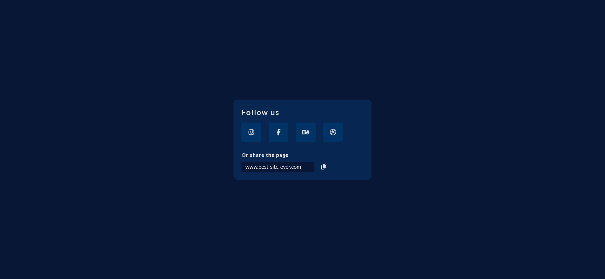

# Share Link Page / ICodeThis Challenge

This is a solution to a challenge "Share Link" from the website [ICodeThis](https://icodethis.com/modes/design-to-code/771/submissions).

## Table of contents
- [Task](#task)
- [Screenshot](#screenshot)
- [Links](#links)
- [How it works](#how-it-works)
  - [Features / Functional Overview](#features--functional-overview)
- [Built with](#built-with)
- [Author](#author)

## Task
Start with this design and transform it into a functional project using HTML, CSS, and JS.
If you want to go the extra mile, expand upon it, and integrate your unique touch by adding animations and interactivity.
Prioritize creativity over pixel-perfect accuracy and showcase your developer ingenuity.

## Screenshot

## Links

[Share Link Page](https://axinitm.github.io/Share-Link-Page-ICodeThis-Challenge-/)

## How it works
This project is a responsive "Share Link" component created for an ICodeThis challenge. It allows users to:
Quickly access social media links to platforms like Instagram, Facebook, Behance, and Dribbble.
Copy the current page's URL to the clipboard for easy sharing.

### Features / Functional Overview

**Social Media Links Section**
Renders a row of icons using Font Awesome for various platforms.
Each icon is wrapped in an anchor (&lt;a&gt;) tag linking to the corresponding external site.
Links open in a new tab and use rel="noopener" for security.

**Copy Link Section**
On page load, the current page URL is auto-filled into the input field.
The user can modify or paste a custom link.
Clicking the copy icon triggers:
Validation of the entered URL (must be a valid format starting with http://, https://, or www.).
Normalization (adds https:// if missing).
If valid, the URL is copied to the clipboard using the Clipboard API.
User receives a success alert; the input is cleared afterward.

**Styling**
Uses CSS custom properties (:root) for consistent color theming and spacing.
Responsive layout:
Optimized for mobile via media queries.
Uses flexbox for clean alignment of content.
Dark-themed interface with subtle hover effects on buttons and icons.

**Dependencies**
Font Awesome v6.5.0 (via CDN) for social media icons.
Google Fonts (Lato) for clean and modern typography.

**Accessibility & UX**
All interactive elements include aria-label and title attributes.
Input field and button are keyboard-accessible.
Alerts provide user feedback for actions and errors.

## Built with

- Semantic HTML5
- Modern CSS3 (Flexbox, Media Queries)
- Vanilla JS

## Author

- Website - [Andrei Martinenko](https://www.frontender.biz)
- Github - [@AxinitM](https://github.com/AxinitM)
- ICodeThis - [Axinit](https://icodethis.com/Axinit)
